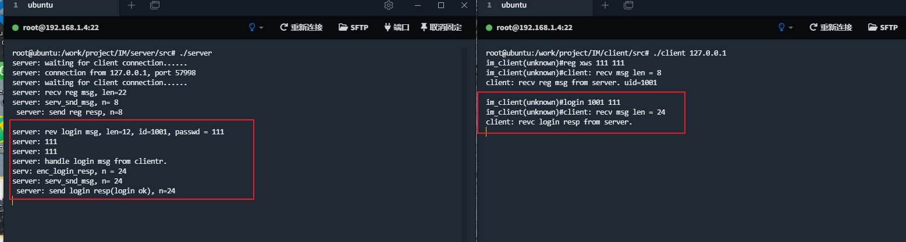

# C语言实现双端即时通讯软件  
  
# 介绍  

# 软件架构  
## 用户注册模块  
1. 注册时，用户提供昵称、密码，通过客户端向服务器发起申请  
2. 服务器响应客户端的申请，为用户分配一个全局唯一的id  

## 用户登陆认证模块  
1. 登陆时，客户端提供用户id和密码，通过客户端向服务器发起申请  
2. 服务器校验用户id和密码，并响应客户端  

## 好友管理模块  
1. 客户端发起好友申请(删除)请求  
2. 服务器响应，增加或者删除好友  

## 消息发送接收模块  
1. 客户端把消息发往服务器，服务器转发给目标好友  
2. 接收消息同样需要经过服务器中转  

## 聊天记录管理  
1. 这里在客户端保存聊天记录

## 信息加解密  
1. 密文传递

## 网络传输模块  
1. 所有网络相关的细节处理
2. 客户端：和服务器通信、消息传递
3. 服务器端：各个用户之间的消息转发

# 服务器与客户端的协议
## 约定(注册消息和聊天消息)
</img>

## 客户端和服务器端的消息交互类型
| 编号 | 消息类型 | 消息子类型 | 描述                        |
| :-------: | :------: | :-----------------: | :-------------------------- |
| 1   | 注册消息 | 0  | **用户注册，向服务器发起注册**  |
| 2   | 登陆认证消息 | 0  | **用户登陆认证消息**  |
| 3   | 好友管理消息 | 好友状态查询 1  | **查询好友是否在线**  |
| 3   | 好友管理消息 | 好友列表查询 2 | **客户端向服务器请求好友列表**  |
| 3   | 好友管理消息 | 增加好友 3 | **客户端向服务器请求增加好友**  |
| 3   | 好友管理消息 | 删除好友 4 | **客户端向服务器请求删除好友**  |
| 3   | 好友管理消息 | 列出所有用户 5 | **客户端向服务器请求列出所有用户**  |
| 4   | 聊天信息 | 0 | **用户向其他用户发送聊天消息**  |
| 5   | 退出消息 | 0 | **用户向服务器发起退出登陆消息**  |

## 客户端总体设计
| 文件名 | 对应模块 | 功能简介 |
| :------------------: | :--------: | :-------------------- |
| client_config.h      | 客户端配置   | 客户端常用配置文件  |
| client_handle.h/.c   | 消息处理     | 客户端消息处理程序 |  
| client_log.h/.c      | 日志管理     | 客户端日志管理  |
| client_user.h/.c     | 好友管理     | 客户端好友管理 |
| cmsg_dec.h/.c        | 消息解析     | 接收消息解析 |
| cmsg_enc.h/.c        | 消息封装     | 消息封装 |
| cusr_cmd.h/.c        | 用户命令处理  | 处理用户输入的命令 |
| im_client.h          | NA          | 所有模块包含的头文件 |
| list.h/.c            | 公共链表库   | 链表库操作 |
| msg_cipher.h/.c      | 消息加解密   | 聊天消息加密和解密 |
| msg_type.h           | 消息类型     | 消息类型及结构体定义 |
| client_main.c        | 客户端主程序  | 客户端主程序 |

## 服务器总体设计
| 文件名 | 对应模块 | 功能简介 |
| :------------------: | :--------: | :-------------------- |
| im_server.h          | 无          | 所有模块包含的头文件  |  
| list.h/.c            | 公共链表库   | 链表库操作 |  
| msg_type.h           | 消息类型     | 消息类型及结构体定义 |  
| server_enc.h/.c      | 消息封装     | 服务器消息封装 |  
| server_dec.h/.c      | 消息解析     | 服务器消息解析  |
| server_handle.h/.c   | 消息处理     | 服务器消息处理 |
| server_user.h/.c     | 用户管理     | 服务器用户管理 |
| server_config.h      | 常用配置     | 服务器常用配置头文件 |
| server_main.c        | 主程序      | 服务器处理主要流程 |

# 安装教程  
分别编译client和server目录下的Makefile  
测试：server和client都在本机运行  
使用：server需要部署在服务器，client部署在客户端  
# 使用说明  
## 运行
server：直接运行程序即可(必须先运行server程序)  
client：需加上ip作为参数(本机测试时使用127.0.0.1即可)  
</img>  

## 帮助信息
</img>  

## 注册
</img>  

## 登陆
</img>  

## 增加好友 && 查看好友列表
</img>  

## 查看所有在线用户
</img>  

## 查看好友状态
</img>  

## 显示当前用户信息
</img>  

## 聊天
</img>  

## 查找聊天记录
</img>  

# 参与贡献  
客户端和服务器端编码，实现相应功能  